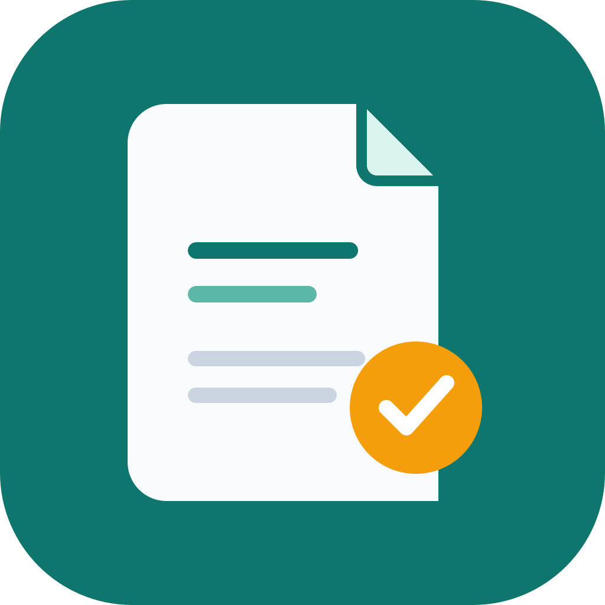

<div align="center">



# AI Session Summary

### 把散落在不同 AI 工具里的对话，整理成每天都能回看的工程日志。

一个面向 macOS 的本地 AI 会话日报应用。读取 Codex、Claude Code、豆包和 DeepSeek 的当天会话，通过 OpenAI 兼容模型生成简洁日报，最终保存为 Markdown。

<p>
  
  
  
  
</p>

</div>

---

## 为什么做它

一天里可能在 Codex 里写代码，在 Claude Code 里排查问题，在豆包或 DeepSeek 里查资料。对话分散在不同应用和网页中，真正值得留下的工作结论却很容易被淹没。

> 读取当天发生过的 AI 会话，提炼完成事项、重点学习和明日建议，形成一页轻量的个人工作日志。

它不是聊天客户端，也不是后台监控工具。它更像一个安静的日终整理器。

## 下载与安装

当前安装包适用于 **Apple Silicon Mac（M 系列芯片）**。发布安装包后，前往 [GitHub Releases](https://github.com/kfcLJH-HUB/summary_app/releases)，在对应版本的 **Assets** 中下载：

| 文件 | 用途 |
| --- | --- |
| `AI Session Summary-0.1.0-arm64.dmg` | 推荐：打开 DMG，将应用拖入“应用程序”文件夹 |
| `AI Session Summary-0.1.0-arm64.zip` | 备用：解压后将 `.app` 拖入“应用程序”文件夹 |

首次打开未签名的应用时，macOS 可能拦截运行；确认文件来源可信后，可在“系统设置 → 隐私与安全性”中选择“仍要打开”。无需安装 Node.js 即可运行安装包。仓库为私有仓库，下载者需要获得访问权限。

**当前仅在本机生成了安装包，尚未发布 GitHub Release。** 发布前，Releases 页面不会提供 DMG 或 ZIP 下载。

## 核心能力

| 能力 | 说明 |
| --- | --- |
| 本地会话读取 | 扫描 Codex 与 Claude Code 的 JSONL 会话文件，支持跨文件合并、标题读取和消息去重 |
| 网页会话接入 | 在应用内登录豆包、DeepSeek，使用持久化网页 Session 读取当天对话 |
| 多来源统一 | 将不同工具转换为统一的会话、消息和来源模型 |
| 智能日报 | 支持 OpenAI、DeepSeek、智谱、硅基流动等 OpenAI 兼容 API |
| 本地降级 | 未填写 API Key 时，使用本地规则生成基础日报 |
| 自动整理 | 启动时读取一次，此后每 5 分钟读取一次；应用运行时每天 19:00 自动生成日报 |
| Markdown 输出 | 默认保存到 `~/Documents/AI-Daily-Summaries/YYYY-MM-DD.md` |
| 可定制提示词 | 在设置中修改日报生成提示词和输出格式 |
| 路径自动检测 | 自动检查默认的 Codex、Claude Code 会话目录，也支持手动添加路径 |

## 日报长什么样

默认日报只保留高价值信息：

1. **今日完成事项**：每个有实质内容的会话通常归纳为一条，先给结论，再补充关键细节。
2. **重点学习**：只提取真正学到的技术概念、工作方法和可复用结论。
3. **明日建议**：只保留有明确依据的后续动作，最多一条。
4. **来源统计与会话清单**：记录 Codex、Claude Code、豆包和 DeepSeek 的使用情况。

默认 LLM 提示词会忽略寒暄、感谢、单个英语单词查询和无实质信息的短问答。未配置 API Key 时的基础日报仅列出部分会话标题，不具备同等的语义归纳能力。

## 工作方式

```text
Codex JSONL ─┐
Claude JSONL ─┼─> 统一解析与去重 ─> 当日会话 ─> 日报生成 ─> Markdown 文件
豆包网页 ────┤
DeepSeek 网页┘
```

### 本地工具

默认读取：

```text
~/.codex/sessions/**/*.jsonl
~/.codex/archived_sessions/**/*.jsonl
~/.claude/projects/**/*.jsonl
```

Codex 会优先使用 `~/.codex/session_index.jsonl` 中的原生标题；Claude Code 会读取 `ai-title` 记录。读取器过滤系统注入、思考过程和原始工具输出，保留当天的用户与助手文本。

### 网页工具

豆包和 DeepSeek 使用 Electron `WebContentsView` 内嵌官方网页：

1. 第一次勾选工具时，如果未登录，会打开对应登录页。
2. 登录状态保存在应用的持久化 Session 中。
3. 后续读取通过网页上下文获取会话数据，无需向主进程传递 Cookie。
4. 网页改版或接口变化可能导致读取失败，应用会显示连接状态与错误提示。

网页接入依赖第三方网页当前实现，不代表相关服务的官方 API 或稳定开放接口。

## 快速开始

### 环境要求

- macOS（打包脚本目前针对 Apple Silicon）
- Node.js 18 或更高版本
- npm

### 安装与开发

```bash
git clone https://github.com/kfcLJH-HUB/summary_app.git
cd summary_app
npm install
npm run dev
```

开发模式会同时启动 Vite 渲染器和 Electron 主进程。

### 生产构建并运行

```bash
npm run typecheck
npm test
npm run build
npm start
```

### 打包 macOS 安装包

```bash
npm run package:mac
```

生成的 DMG 和 ZIP 位于 `release/`。仅生成 `.app` 目录可运行 `npm run package:mac:dir`。当前配置面向 Apple Silicon，安装包尚未进行 Apple 开发者签名或公证。

要让其他人通过上方的下载入口获取安装包，请在 GitHub 仓库的 **Releases → Draft a new release** 中创建版本（例如 `v0.1.0`），把 `release/` 内的 DMG 和 ZIP 上传为附件后发布。`release/` 已被 Git 忽略，不会随源码 `git push` 自动上传。

## 配置日报模型

打开应用右上角设置，填写：

| 配置 | 示例 |
| --- | --- |
| API Base URL | `https://api.openai.com` |
| API Key | 你的服务密钥 |
| 模型 | `gpt-4o-mini`、`deepseek-chat` 等 |
| 日报提示词 | 可按个人偏好修改归纳规则 |

支持兼容 `/v1/chat/completions` 的服务。API Key 不会写入项目目录；应用将配置保存在 Electron 用户数据目录下的隐藏 `.settings.json`，并设为当前用户可读写。当前版本尚未接入 macOS Keychain，配置仍是本机明文文件，请妥善保管设备与密钥。

## 数据与隐私

- 不使用 SQLite、向量数据库或后台同步服务。
- 原始会话只在读取和生成过程中以内存对象处理，不另建会话数据库。
- 本地工具的原始 JSONL 保留在其原有目录，不会复制到项目目录。
- 生成后的 Markdown 日报按用户配置写入磁盘。
- 豆包和 DeepSeek 的登录状态由 Electron 持久化 Session 保存。
- 使用外部 LLM 时，选定日期的会话内容会发送到用户配置的 API 服务。
- 不配置 API Key 时不会请求外部 LLM，而是生成基础日报。

在使用第三方模型服务前，请确认其数据处理政策符合你的需求。

## 项目结构

```text
summary_app/
├── electron/
│   ├── main.ts                 # Electron 主进程与 IPC
│   ├── preload.ts              # 渲染进程安全桥接
│   ├── doubao-preload.ts       # 豆包网页上下文读取
│   └── deepseek-preload.ts     # DeepSeek 网页上下文读取
├── core/
│   ├── codex-reader.ts         # Codex JSONL 读取
│   ├── claude-reader.ts        # Claude Code JSONL 读取
│   ├── normalizer.ts           # 会话合并与去重
│   ├── summarizer.ts           # LLM 调用与本地降级摘要
│   ├── markdown-writer.ts      # Markdown 写入
│   └── types.ts                # 统一数据类型
├── src/
│   ├── App.tsx                 # 主界面
│   └── styles/                 # 应用样式
├── tests/                      # 读取、去重、总结和路径检测测试
└── build/icon.svg              # macOS 应用图标源文件
```

## 当前边界

当前版本刻意保持轻量，暂不包含后台常驻监听、向量数据库、本地 RAG、全文搜索、Notion 同步或多人协作。本地 JSONL 格式、网页 DOM 和网页内部接口都可能随着上游工具更新而变化，因此读取器需要持续维护。

## 开源参考与致谢

本项目独立实现，参考了 Engineering Notebook 的工程日志工作流、AgentHUD 的 Codex/Claude Code 会话结构资料，以及 [VESTI](https://github.com/abraxas914/VESTI) 的豆包网页接入思路。没有直接复制上述项目源码。相关说明见 [THIRD_PARTY_NOTICES.md](THIRD_PARTY_NOTICES.md)。

## 许可证

仓库当前尚未声明正式开源许可证。除第三方依赖和参考项目外，项目代码的使用、修改和再分发请先联系作者确认。

---

<div align="center"><sub>让对话留在工具里，让成果留在每天的记录里。</sub></div>
